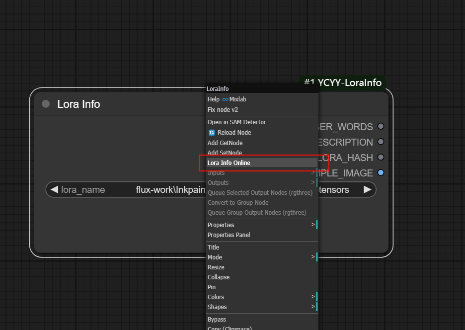

# 获取Lora信息

[**English**](README.md) | [**中文**](README_zh_CN.md)

通过该节点可以获取触发词、描述、示例图片等各种Lora相关信息

## 安装方法

进入ComfyUI 下`custom_nodes` 文件夹, 打开终端执行以下命令：

```
git clone https://github.com/ycyy/ComfyUI-YCYY-LoraInfo.git
```

## 说明

1. 重命名 `lora.json.example` 为 `lora.json`，编辑文件添加你自己的Lora说明 。注意Lora的名字需要和本地lora的名字保持一致。
2. 示例图片放在当前目录下 `images` 文件夹内。
3. 你可以在 `examples` 文件夹下找到示例工作流。
4. 如果你设置了链接属性，你可以在右键菜单通过点击 `Lora Info Online` 查看Lora的在线信息。


